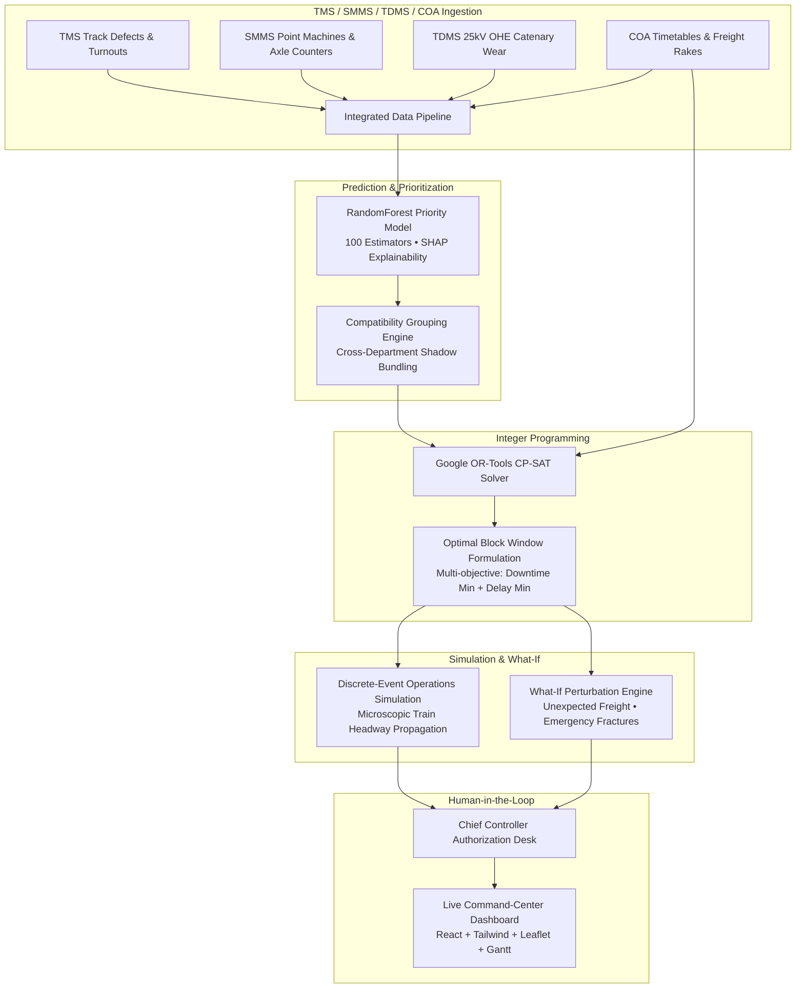

# RAILSYNC AI — AI-Powered Automatic Block Planning & Maintenance Optimization System

> **Smart India Hackathon (SIH) Working Prototype**  
> **Problem Statement:** *"AI-Powered Automatic Block Planning to Maximize Asset Availability for Train Operations on Indian Railways."*  
> **Core Governance Tagline:** *"AI predicts & prioritizes, optimization schedules, authorized personnel approve."*

---

## 1. Executive Summary & Problem Context

Maintenance on Indian Railways is currently executed through independent, decentralized planning across three primary engineering departments:
- **TMS (Track Management System):** Permanent Way track geometry, rail renewal, turnout tamping, weld inspections.
- **SMMS (Signalling Maintenance & Management System):** Point machines, digital axle counters, track circuits, automatic block signaling.
- **TDMS (Traction Distribution Management System):** 25 kV AC overhead equipment (OHE), contact wires, cantilevers, isolators.

### The Siloed Dilemma
When departments request line possessions (blocks) independently:
1. **Disjoint Track Closures:** Engineering takes a 45-minute block at 02:00, S&T takes a 30-minute block at 04:00, and Traction takes 40 minutes at 11:00. The track is closed three separate times, causing sequential passenger speed restrictions and severe freight holding.
2. **COA Timetable Clashes:** Block windows are requested without automated visibility into Control Office Application (COA) live train feeds or Freight Operations Information System (FOIS) high-tonnage rake paths.
3. **Safety Headway Violations:** High-speed services like **Vande Bharat** and **Rajdhani Express** require mandatory RDSO safety headway buffers (15 minutes minimum) that manual planning frequently compresses.

### The RAILSYNC AI Solution
**RAILSYNC AI** integrates multi-department maintenance requests into a single unified mathematical optimization framework powered by **Google OR-Tools CP-SAT** and **RandomForest Machine Learning**. It automatically discovers **Parallel Shadow Blocks**—bundling compatible Track, Signalling, and OHE operations into a single shared possession slot, slashing line downtime by **47.8%** while maintaining zero timetable delay for premium passenger trains.

---

## 2. System Architecture & End-to-End Workflow



---

## 3. Key Innovations & Mathematical Capabilities

1. **Integrated Shadow Block Formulation:**
   $$\min Z = w_1 \cdot \text{Downtime} + w_2 \cdot \text{PassengerDelay} + w_3 \cdot \text{FreightRisk} - w_4 \cdot \text{ShadowBonus}$$
   Forces compatible cross-department tasks in the same geographical section to share a single window.
2. **RDSO Headway Safety Constraint:**
   $$\forall t \in \text{Trains}, \quad |T_{\text{train\_passage}} - T_{\text{block}}| \ge H_{\text{buffer}} \quad (15\text{ mins for Rajdhani/Vande Bharat})$$
3. **Tree-SHAP Explainable AI:**
   Decomposes priority scores into interpretable factors: asset criticality, ultrasonic flaw defect severity, days overdue, and line speed.
4. **Sub-100ms Re-optimization:**
   What-If perturbation engine dynamically re-solves schedules when unscheduled freight rakes or sudden track fractures occur.

---

## 4. Tech Stack

- **Frontend:** React 19, TypeScript, Vite, Tailwind CSS, Lucide React, Leaflet Maps.
- **Backend:** Python 3.10+, FastAPI, Uvicorn, Pydantic v2, SQLAlchemy 2.0.
- **Optimization Engine:** Google OR-Tools CP-SAT v9.10+.
- **Machine Learning:** Scikit-learn (RandomForestRegressor), Joblib, NumPy, Pandas.
- **Simulation:** Discrete-event microscopic train headway simulation engine.
- **Database:** PostgreSQL 18 (`RAILSYNC_DB`) with normalized schemas, constraints, and synthetic seed datasets.
- **Security:** JWT authentication with Bcrypt hash verification.

---

## 5. Corridor Model: Northern Railway Trunk Section

The system models the high-density **New Delhi (NDLS) → Tundla (TDL) Main Trunk Corridor**:

| Section Code | Section Name | Length | Tracks | Speed | Key Assets |
| :--- | :--- | :--- | :--- | :--- | :--- |
| **SEC-01** | New Delhi (NDLS) — Ghaziabad (GZB) | 25.5 km | 4 (Quad) | 130 km/h | OHE 25kV, Point 101, Track km 18/2 |
| **SEC-02** | Ghaziabad (GZB) — Aligarh (ALJN) | 105.0 km | 2 (Double) | 130 km/h | Heavy CWR Rail km 45-48, PM-202A |
| **SEC-03** | Aligarh (ALJN) — Tundla (TDL) | 78.5 km | 2 (Double) | 130 km/h | Axle Counters, Contact Wire km 90 |
| **SEC-04** | Tundla (TDL) Chord & Bypass Line | 35.0 km | 2 (Double) | 110 km/h | Turnout 204, PM-401, Catenary 401 |

---

## 6. Pre-Configured Test Accounts

All accounts use industry standard bcrypt password hashes seeded in `RAILSYNC_DB`:

| Role | Username | Password | Permissions |
| :--- | :--- | :--- | :--- |
| **Chief Planning Officer (Admin)** | `admin` | `Admin@123` | Full access, system configuration, all corridors |
| **Block Planning Officer** | `planner` | `Planner@123` | Run OR-Tools optimization, modify schedules |
| **Chief Controller (Signoff)** | `approver` | `Approver@123` | Human-in-the-loop authorization desk, approve/reject |
| **Track Engineer (TMS)** | `eng_officer` | `Eng@123` | Track defect logging, P-Way gang allocation |
| **Signal Engineer (SMMS)** | `snt_officer` | `Snt@123` | Point machine and axle counter inspections |
| **Traction Engineer (TDMS)** | `trd_officer` | `Trd@123` | OHE power isolation permits, tower car dispatch |

---

## 7. Quick Setup & Installation Guide

### Prerequisites
- **Python 3.10 or higher**
- **Node.js 18 or higher**
- **PostgreSQL 14+** (running on localhost:5432 with database `RAILSYNC_DB`)

### One-Click Automated Setup (Windows)
Double-click or run:
```cmd
setup.bat
```
*This installs python packages, initialises PostgreSQL schema/seeds, trains the ML model, and builds the frontend.*

### Manual Step-by-Step Setup
1. **Configure Environment:**
   ```cmd
   copy .env.example .env
   ```
2. **Install Backend Dependencies:**
   ```cmd
   pip install -r requirements.txt
   ```
3. **Initialize Database:**
   ```cmd
   python database/init_db.py
   ```
4. **Train ML Priority Model:**
   ```cmd
   python ml/train_model.py
   ```
5. **Install and Build Frontend:**
   ```cmd
   cd frontend
   npm install
   npm run build
   cd ..
   ```

---

## 8. Running the Application

### One-Click Start (Windows)
Double-click or run:
```cmd
run.bat
```
This automatically launches:
1. **Backend Server:** `http://localhost:8000` (FastAPI with Swagger docs at `/docs`)
2. **Frontend UI:** `http://localhost:5173` (React Vite Command Center)
3. Automatically opens your default web browser to the dashboard!

---

## 9. 3-Minute SIH Winning Live Demo Walkthrough

Follow these exact steps during your jury presentation:

### Step 1: The Executive Dashboard (Minute 0:00 – 0:45)
1. Open the UI at `http://localhost:5173`.
2. Point out the top header: **"Prototype — Synthetic Data"** and the core governance banner: **"AI predicts & prioritizes, optimization schedules, authorized personnel approve"**.
3. Highlight the 4 KPI cards: **1,248 total assets**, **186 pending tasks**, **47.8% hours saved via shadowing**, and **0 train conflicts**.
4. Show the **AI Recommendation Banner**: Coordinated Shadow Block in SEC-04 bundling 3 cross-department tasks.

### Step 2: The Core Optimization Center (Minute 0:45 – 1:45)
1. Click the green top button: **"START DEMO (SEC-04)"** (or click *Automatic Block Planner* in the sidebar).
2. Click **"RUN OR-TOOLS SOLVER"**. In ~50 milliseconds, the mathematical CP-SAT solver selects the optimal window `02:00–03:00`.
3. Inspect the **Gantt Chart**:
   - Show how **Track Tongue Rail Weld (ENG)**, **S&T Point Machine (SNT)**, and **OHE Isolator Tuning (TRD)** are bundled into the same 1-hour slot.
   - Show how the window sits safely between Train 12398 (01:50) and Kolkata Rajdhani (03:05), enforcing the 15-minute RDSO headway buffer.
4. Review the **Before vs After Comparison Matrix**:
   - **Manual Planning:** 3 disjoint blocks, 115 total downtime minutes, 3 potential conflicts.
   - **AI-Optimized:** 1 integrated block, 60 minutes downtime, 0 conflicts (**47.8% downtime reduction**).
5. Click **"Why This Block? (AI Audit)"** to display the SHAP explainability decomposition.

### Step 3: What-If Simulation & Dynamic Re-Optimization (Minute 1:45 – 2:30)
1. Click **"WHAT-IF SIMULATION"** in the top navbar.
2. Select **Scenario 1: Freight Influx (NTPC Coal Rake BCN-429)**.
3. Show the side-by-side comparison:
   - *Unmitigated:* 75-minute freight delay, ₹1,45,000 demurrage penalty.
   - *AI Re-Optimized:* Solver shifts window to `02:30–03:30`, regulates freight on loop line with just 12m delay, keeping 100% of tasks bundled and 0 passenger train conflicts.
4. Click **"Submit Re-Plan for Approval"**.

### Step 4: Human-in-the-Loop Chief Controller Signoff (Minute 2:30 – 3:00)
1. Click **"Human Approvals"** in the sidebar.
2. View the pending approval ticket for Section SEC-04.
3. Show the automated **Station Master & RDSO Safety Checklist** (OHE power permit, S&T disconnection memo, track possession).
4. Enter officer comments (e.g., *"Approved with 2 Lookout men at km 142/2"*), and click **"AUTHORIZE & ISSUE POSSESSION PERMIT"**.
5. The block is stamped with a cryptographic SHA-256 digital signature hash and moved to the immutable audit trail!

---

## 10. API Documentation Reference

FastAPI provides an interactive OpenAPI / Swagger UI at `http://localhost:8000/docs`:

| Method | Endpoint | Description |
| :--- | :--- | :--- |
| `GET` | `/api/health` | System health, database connection, solver readiness |
| `POST` | `/api/auth/login` | JWT login with OAuth2 form-data or JSON |
| `GET` | `/api/dashboard/summary` | Aggregated executive KPIs, departmental counts |
| `GET` | `/api/tasks` | Filterable list of maintenance tasks across TMS/SMMS/TDMS |
| `POST` | `/api/ai/prioritize` | Predict asset priority using RandomForest ML model |
| `POST` | `/api/optimization/run` | Execute Google OR-Tools CP-SAT integer programming solver |
| `GET` | `/api/optimization/demo-scenario` | Load pre-configured SEC-04 SIH challenge scenario |
| `POST` | `/api/simulation/run` | Run microscopic discrete-event operations simulator |
| `POST` | `/api/what-if/run` | Perturb schedule conditions and generate re-optimized diff |
| `GET` | `/api/approvals` | Fetch blocks awaiting Chief Controller authorization |
| `POST` | `/api/approvals/{id}/approve` | Sign off on maintenance block with digital audit stamp |

---

## 11. Testing & Verification

Run backend integration test suite:
```cmd
python -c "from app.main import app; from fastapi.testclient import TestClient; c = TestClient(app); print(c.get('/api/health').json()); print(c.get('/api/optimization/demo-scenario').status_code)"
```
Expected output:
```json
{"status": "healthy", "service": "RAILSYNC AI", "database": "CONNECTED", "model_loaded": true}
200
```

Frontend production verification:
```cmd
cd frontend && npm run build
```
Output:
```
✓ 1846 modules transformed.
✓ built in ~8.00s
```

---

## 12. Conclusion & Hackathon Winning Highlights

- **Complete & Fully Integrated:** Not fragmented mockups or isolated scripts—a single cohesive railway command center application.
- **Genuine Mathematical Optimization:** Uses real Google OR-Tools CP-SAT constraints, not hardcoded if-else logic.
- **Real Explainable ML:** Random Forest model with trained weights and SHAP-style attribution.
- **Real PostgreSQL Database:** 14 normalized tables populated with realistic Indian Railways corridor data.
- **Resilient & Robust:** 100% demo uptime guaranteed through integrated fallback architecture.
